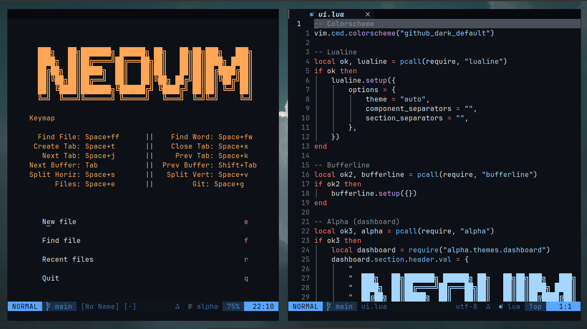

# ⚡ BARU's Neovim

> A lightweight Neovim configuration built for my i3 Debian setup.
>
> Fast. Theme-synced. Keyboard-first.

<p align="center">
  
</p>

<p align="center">


</p>

---

## 🎯 Philosophy

This configuration is designed around three simple principles:

- Keep it lightweight
- Keep it understandable
- Keep it synchronized with the desktop

Every plugin should justify its existence.

Every file should be easy to understand and modify.

No frameworks. No unnecessary complexity. Just Neovim.

---

## ✨ Features

- ⚡ Lightweight custom Lua plugin manager
- 🎨 Automatic i3 theme synchronization
- 📁 Oil.nvim file explorer
- 🔍 FZF-Lua fuzzy finder
- 🌳 Treesitter syntax highlighting
- 📊 Lualine statusline
- 📑 Bufferline tabs
- 🔐 Git integration with Fugitive & Gitsigns
- 📝 Markdown-focused workflow
- 🌈 Multiple colorschemes
- 🪟 Optional transparency support
- 🚀 Fast startup and minimal overhead

---

## 🎨 Theme Integration

> **Not using my i3 + Neovim ecosystem?**
>
> By default, this configuration reads the active theme from:
>
> ```text
> ~/.config/i3/.current_theme
> ```
>
> If you're using this Neovim configuration standalone, open:
>
> ```text
> ~/.config/nvim/lua/themes/theme-loader.lua
> ```
>
> and replace:
>
> ```lua
> require("themes.theme-loader").load()
> ```
>
> with:
>
> ```lua
> vim.cmd.colorscheme("github_dark_default")
> ```
>
> You can replace `github_dark_default` with any installed colorscheme, such as:
>
> - `catppuccin-frappe`
> - `rose-pine-moon`
> - `kanagawa-wave`
> - `everforest`
> - `gruvbox`
> - `nord`
> - `dracula`
> - `moonfly`
>
> or any other colorscheme you prefer.

One of the core features of this configuration is desktop theme synchronization.

Neovim automatically follows the currently selected i3 theme by reading:

```text
~/.config/i3/.current_theme
```

Whenever a theme is changed through the i3 theme menu, Neovim automatically loads the matching colorscheme on startup.

### Supported Themes

| i3 Theme | Neovim Theme |
|-----------|-------------|
| Gruvbox | Gruvbox |
| Nord | Nord |
| Dracula | Dracula |
| Rose Pine | Rose Pine Moon |
| Catppuccin | Catppuccin Frappe |
| Kanagawa | Kanagawa Wave |
| Everforest | Everforest |
| GitHub Dark | GitHub Dark |
| Moonfly | Moonfly |

---

## 🖼 Showcase

### Dashboard

- Alpha startup screen
- Quick shortcuts
- Clean minimal interface

### Navigation

- Oil.nvim file explorer
- FZF-Lua fuzzy searching
- Bufferline tab management

### Git Workflow

- Git status via Fugitive
- Inline git changes via Gitsigns
- Git branch management

### Writing

- Markdown preview
- Markdown rendering
- Todo highlighting

---

## 🚀 Installation

### If you already have a Neovim configuration:
```bash
mv ~/.config/nvim ~/.config/nvim.backup
```

or  Remove Existing Neovim Configuration


```bash
rm -rf ~/.config/nvim
```

### Automatic Installation

```bash
git clone https://github.com/6aru/nvim.git

cd nvim

chmod +x install.sh

./install.sh
```

### Manual Installation

```bash
git clone https://github.com/6aru/nvim ~/.config/nvim

nvim
```

Plugins will automatically install on first launch.

---

## 📋 Requirements

### Required

- Neovim 0.10+
- Git

### Recommended

- Ripgrep
- FZF
- fd
- NodeJS
- npm

### Optional

- Prettier
- JetBrainsMono Nerd Font
- i3 Window Manager (for theme synchronization)

---

## 🧩 Plugin Highlights

| Plugin | Purpose |
|----------|----------|
| Alpha.nvim | Startup dashboard |
| Oil.nvim | File explorer |
| FZF-Lua | Fuzzy finder |
| Treesitter | Syntax parsing |
| Bufferline | Buffer tabs |
| Lualine | Statusline |
| Gitsigns | Git indicators |
| Fugitive | Git workflow |
| Which-Key | Keybinding helper |
| Render Markdown | Markdown rendering |
| Todo Comments | TODO highlighting |
| Colorizer | Color preview |
| nvim-surround | Surround text objects |
| Comment.nvim | Easy commenting |

---

## ⌨ Keybindings

### General

| Key | Action |
|------|---------|
| Space+e | File Explorer |
| Space+ff | Find Files |
| Space+fw | Live Grep |
| Space+fh | Help Tags |
| Space+fc | Search Config |

### Buffers & Tabs

| Key | Action |
|------|---------|
| Tab | Next Buffer |
| Shift+Tab | Previous Buffer |
| Space+t | New Tab |
| Space+x | Close Tab |
| Space+j | Next Tab |
| Space+k | Previous Tab |

### Git

| Key | Action |
|------|---------|
| Space+gg | Git Status |
| Space+gb | Git Branches |

### Markdown

| Key | Action |
|------|---------|
| Space+pp | Markdown Preview |

---

## 📁 Directory Layout

```text
nvim/
├── init.lua
│
├── lua/
│   ├── core/
│   │   ├── options.lua
│   │   ├── keybinds.lua
│   │   └── autocmds.lua
│   │
│   ├── plugins/
│   │   ├── ui.lua
│   │   ├── navigation.lua
│   │   ├── editing.lua
│   │   ├── git.lua
│   │   ├── treesitter.lua
│   │   └── todo.lua
│   │
│   ├── themes/
│   │   └── theme-loader.lua
│   │
│   ├── plugin-list.lua
│   └── plugin-manager.lua
│
├── assets/
│   └── screenshot.png
│
├── install.sh
├── README.md
└── .gitignore
```

---

## 🗺 Roadmap

- [x] Custom Lua plugin manager
- [x] i3 theme synchronization
- [x] Git integration
- [x] Markdown workflow
- [x] Multi-theme support
- [ ] Mason integration
- [ ] LSP support
- [ ] Theme preview system
- [ ] Automatic theme installer
- [ ] Session management

---

## 🤝 Contributing

This repository is primarily a personal configuration, but ideas, suggestions, and improvements are always welcome.

Feel free to open an issue or submit a pull request.

---

## 🙏 Credits

This project was built on ideas and inspiration from:

- https://github.com/tonybanters/nvim
- https://codeberg.org/justaguylinux

Their work provided the foundation for my nvim-config structure, plugin management ideas, and many design concepts that helped shape this configuration.

---

<p align="center">
  Built with ❤️ using Neovim, Lua, Debian, and i3.
</p>
